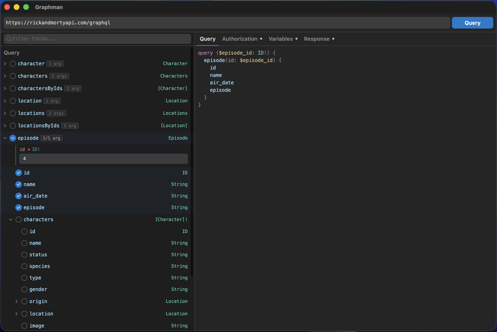

<div align="center">
  

# Graphman

**The effortless GraphQL query builder for your desktop.**

[](https://github.com/muba00/graphman/releases)
[](LICENSE)
[](#download-and-install)

  <br />
  
</div>

## 🌟 What is Graphman?

Graphman is an intuitive, fast, and lightweight desktop application designed to make working with GraphQL APIs incredibly simple. Just think of it like Postman, but optimized entirely for GraphQL!

Whether you're a non-technical user exploring an API, or a developer composing a complex query, Graphman has you covered.

## ✨ Features

- **🔌 Simple Endpoint connection:** Just paste your GraphQL endpoint URL, and Graphman handles the rest.
- **🌳 Interactive Checkbox Tree:** No need to construct queries by hand. Graphman automatically fetches the API schema and displays all available fields as a simple, clickable checkbox tree.
- **⚡️ Smart Query Generation:** Select the fields you want to see, and the app instantly generates the exact GraphQL query string you need.
- **🚀 Lightning Fast Native App:** Built securely for your OS using Rust (Tauri), ensuring a smooth, responsive experience with zero bloat and low memory consumption.
- **🔐 Private & Secure:** Your queries stay on your machine. Graphman talks directly to your APIs without any tracking or middleman servers.

---

## 🚀 Download and Install

You can easily install Graphman on your computer—no programming knowledge required!

1. Go to the [**Releases**](https://github.com/muba00/graphman/releases) page.
2. Download the installer for your operating system (macOS `.dmg`, Windows `.exe`, or Linux `.AppImage`).
3. Run the installer and launch the app!

###  macOS users

Before opening the app, you need to run the following in Terminal:

```bash
xattr -cr /Applications/Graphman.app
```

---

## 💻 For Developers: Build from Source

Want to tinker with the code? Graphman uses an ultra-fast modern stack: **React 19**, **Vite**, **TypeScript**, and **Tauri** (Rust backend).

### Prerequisites

- Node.js (v18+)
- [Rust & Cargo](https://rustup.rs/)

### Local Development

**1. Clone the repo:**

```bash
git clone https://github.com/muba00/graphman.git
cd graphman
```

**2. Install dependencies:**

```bash
npm install
```

**3. Start the development server (runs full desktop app):**

```bash
npm run tauri dev
```

**4. Build for release:**

```bash
npm run tauri build
```

## 🤝 Contributing

Contributions, issues, and feature requests are always welcome! Feel free to check the [issues page](https://github.com/muba00/graphman/issues).
